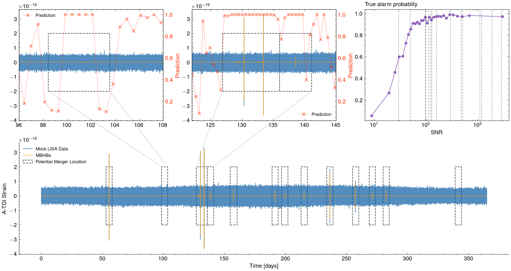

# Rapid search for massive black hole binary coalescences using deep learning


**Wen-Hong Ruan<sup>1,2,$\dagger$</sup>, He Wang<sup>1,$\dagger$</sup>, Chang Liu<sup>3,2</sup>, Zong-Kuan Guo<sup>1,2,3</sup>**

<sub>1. CAS Key Laboratory of Theoretical Physics, Institute of Theoretical Physics, Chinese Academy of Sciences, Beijing 100190, China</sub>  
<sub>2. School of Physical Sciences, University of Chinese Academy of Sciences, No.19A Yuquan Road, Beijing 100049, China</sub>  
<sub>3. School of Fundamental Physics and Mathematical Sciences, Hangzhou Institute for Advanced Study, University of Chinese Academy of Sciences, Hangzhou 310024, China</sub>  
<sub>$\dagger$. contribute equally</sub>  


[]() <!-- [](https://ieeexplore.ieee.org/abstract/document/9663260/)  -->

## Abstract

The coalescences of massive black hole binaries are one of the main targets of space-based gravitational wave observatories. Such gravitational wave sources are expected to be accompanied by electromagnetic emission. Low latency gravitational wave searches and accurate sky localization are key to successful follow-up observations of electromagnetic counterpart radiation. Here, we present a deep learning method for the first time to rapidly search for signals of massive black hole binaries in gravitational wave data. Our model is capable of processing 1-year of data, simulated from the LISA data challenge, in several seconds only, while identifying all coalescences of massive black hole binaries with no false alarms. We further demonstrate that the model shows robust resistance to a wide range of generalization cases, including various waveform families and updated instrumental configurations. This method is supposed to be an effective approach, which combined the advances of artificial intelligence to open a new pathway for space-based gravitational wave observations.


## Usage

- See `./notebooks/notebook.ipynb` for how to evaluate the model.


## Results

<br/>


## License and Citation

Copyright (c) 2021-2022  ITP-CAS

Licensed under the MIT license. For copyright information, consult the LICENSE file.

If you use the material provided here, please cite the paper using the reference:

```
TBA
```

## Acknowledgments
